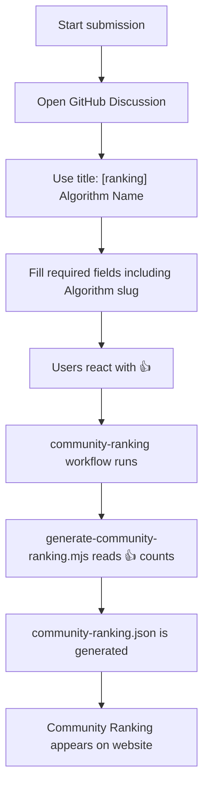

# Community Ranking

Community Ranking is the Labs area for algorithms that stand out because people respond to them.

## What It Is

This page is meant to become a ranked list of algorithms based on community signal, not benchmark speed.

## Requirements

| Requirement | Rule |
| --- | --- |
| Submit place | GitHub Discussion |
| Title format | `[ranking] Algorithm Name` |
| Required identity field | `Algorithm:` slug |
| Voting method | GitHub reactions (`👍`) |
| Category value | `Most Fun` / `Best Visualization` / `Most Creative` / `Community Favorite` |
| Event value | optional, but must match exact event name when used |

## Submission Format

```md
Title: [ranking] Example Sort

Name:
Example Sort

Algorithm:
example-sort

URL:
https://sorting.1234567890.dev/algo/example-sort

Why it's interesting:
Short explanation of why people should care.

Category:
Community Favorite

Event:
Sort Labs Challenge Season 2026-1

Visualization notes:
Optional notes.
```

## Score Rule

Each discussion collects `👍` reactions.

```text
score = number of 👍 reactions
```

Do not rely on GitHub poll APIs for community ranking.

## What It Should Emphasize

- interesting ideas
- strong visualization
- clever or funny execution
- clear explanation of why the algorithm matters

## What It Should Not Pretend

If there is not enough real signal yet, the page should not invent standings. It should show a collection placeholder and wait for real submissions.

## How to Participate

1. Propose or submit an algorithm
2. Use a consistent `Algorithm:` slug
3. Explain what makes it interesting
4. Let users react with `👍`
5. Open a pull request when the implementation is ready

## Process


